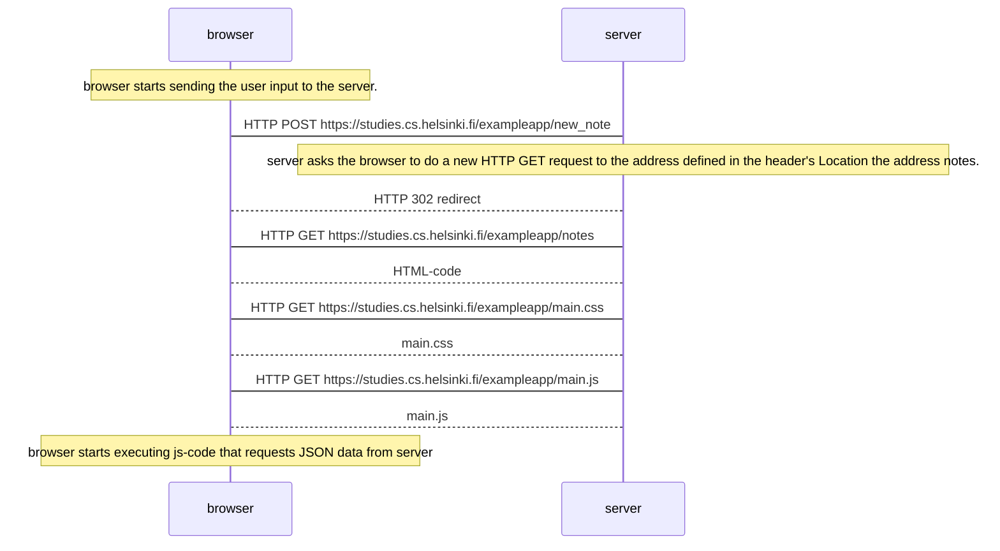

```mermaid
sequenceDiagram
    participant browser
    participant server
    Note over browser: browser starts sending the user input to the server.
    browser->server: HTTP POST https://studies.cs.helsinki.fi/exampleapp/new_note
    Note over server: server asks the browser to do a new HTTP GET request to the address defined in the header's Location the address notes.
    server-->browser: HTTP 302 redirect
    browser->server: HTTP GET https://studies.cs.helsinki.fi/exampleapp/notes
    server-->browser: HTML-code
    browser->server: HTTP GET https://studies.cs.helsinki.fi/exampleapp/main.css
    server-->browser: main.css
    browser->server: HTTP GET https://studies.cs.helsinki.fi/exampleapp/main.js
    server-->browser: main.js
    Note over browser: browser starts executing js-code that requests JSON data from server
```
