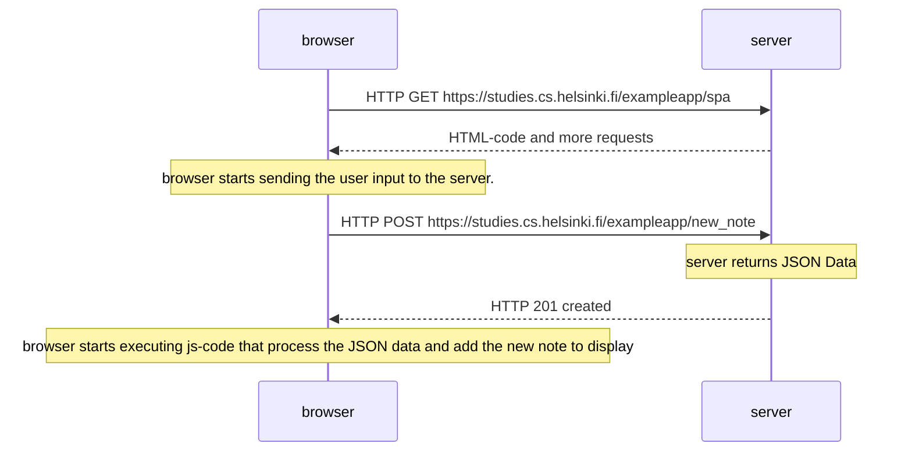

```mermaid
sequenceDiagram
    participant browser
    participant server

    browser->>server: HTTP GET https://studies.cs.helsinki.fi/exampleapp/spa
    server-->>browser: HTML-code and more requests
    note over browser: browser starts sending the user input to the server.

    browser->>server: HTTP POST https://studies.cs.helsinki.fi/exampleapp/new_note
    note over server: server returns JSON Data

    server-->>browser: HTTP 201 created
    note over browser: browser starts executing js-code that process the JSON data and add the new note to display
```
